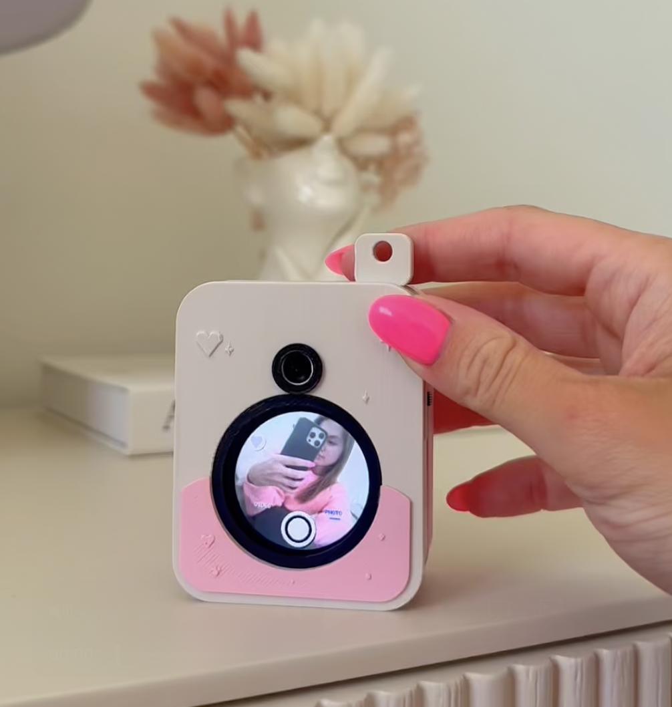

# PocketCam: Pink ESP32S3 DIY Camera

<p align="center">
  
</p>

A tiny pink DIY camera built with a Seeed XIAO ESP32S3 Sense, an OV3660 camera module, a round display, microSD storage, a LiPo battery, and a custom 3D printed enclosure.

The goal of this project was to make a small camera that feels more like a real mini product than a loose electronics prototype. PocketCam shows a live preview on the round screen, captures photos and videos, saves them to microSD, creates its own local Wi-Fi network, and lets an iPhone connect directly to sync photos into a custom SwiftUI app.

This repository includes the ESP32 firmware, iPhone app, 3D printed enclosure files, hardware notes, and documentation for the project.

## What Makes It Interesting

* The ESP32S3 acts as a standalone camera and local Wi-Fi access point.
* The camera exposes a small HTTP API for syncing photos and videos.
* The iPhone app talks directly to the camera without internet or cloud.
* Photos and videos are saved locally to the microSD card.
* The iPhone app adds a gallery, filters, and on-device Core ML enhancement.
* The enclosure was designed from scratch to make the project feel like a real small device.

## Features

* Live camera preview on a round display
* Photo and video capture
* microSD card saving
* Local Wi-Fi access point mode
* Local web server for syncing
* iPhone SwiftUI app for gallery and photo sync
* Photo filters
* On-device Enhance feature using a compact Real-ESRGAN Core ML model
* Custom OpenSCAD 3D printed enclosure
* Battery-powered design with a physical power switch
* Small product-style case instead of a breadboard prototype

## Hardware

Main parts used:

| Part                         | Description                                         |
| ---------------------------- | --------------------------------------------------- |
| Seeed XIAO ESP32S3 Sense     | Main microcontroller board                          |
| OV3660 camera module         | Camera sensor                                       |
| Seeed round display for XIAO | 1.28 inch round display                             |
| microSD card                 | Local photo/video storage                           |
| LiPo battery                 | Portable power                                      |
| Slide switch                 | Main power switch                                   |
| Custom 3D printed enclosure  | Front shell, back cover, openings, and internal fit |
| Screws / brass inserts       | Used for assembly                                   |
| Small wires / heat tape      | Internal wiring and insulation                      |

## Software / Firmware

The ESP32 firmware handles the main camera behavior:

* Camera initialization
* Round display live preview
* Photo and video capture
* Saving files to microSD
* Creating a local Wi-Fi access point
* Running a small local web server
* Sending saved files to the iPhone app

The camera creates its own Wi-Fi network, so it does not need internet or a router. The iPhone connects directly to the camera and downloads files over the local network.

## Camera API

The ESP32 hosts a small local HTTP server used by the iPhone app.

Example endpoints:

```txt
GET /status.json
GET /photos.json?since=0&limit=12
GET /photo?id=123
GET /latest
GET /videos.json?since=0&limit=1
GET /video?id=5
GET /capture
```

These endpoints are used to check the camera status, list saved media, download photos/videos, and trigger capture from the app.

## iPhone App

The iPhone app was built with SwiftUI.

It can:

* Connect to the PocketCam Wi-Fi network
* Check for saved photos
* Sync photos from the camera
* Show photos in a gallery
* Apply additional filters
* Run an on-device Enhance feature using a compact Real-ESRGAN Core ML model

The app is not meant to be a full production camera app. It is a companion app for the hardware prototype and helps make the project feel more complete.

## 3D Printed Enclosure

The enclosure was designed in OpenSCAD and 3D printed.

The case includes:

* Round display opening
* Camera/lens opening
* Back cover
* Screw bosses
* Battery space
* Power switch opening
* Internal space for the XIAO ESP32S3 Sense and wiring

A big part of this project was making the camera look and feel like a real small device, not just a working prototype. I spent a lot of time adjusting the case design, screw bosses, display opening, lens opening, back cover, and internal fit so the electronics could fit inside a small enclosure.

## Folder Structure

```txt
Pink_SelfieCamera_esp32/
├── README.md
├── firmware/
│   └── README.md
├── ios-app/
│   └── README.md
├── enclosure/
│   ├── README.md
│   ├── openscad/
│   └── stl/
├── hardware/
│   └── BOM.md
├── docs/
│   ├── images/
│   ├── wiring.md
│   ├── assembly.md
│   └── sync-flow.md
└── media/
    ├── photos/
    └── videos/
```

## How It Works

PocketCam has three main parts:

1. **ESP32S3 camera firmware**
   The ESP32S3 reads from the camera module, shows a live preview on the round display, and saves captured photos/videos to the microSD card.

2. **Local Wi-Fi sync**
   The camera creates its own Wi-Fi access point. The iPhone connects directly to that network and communicates with the ESP32 through local HTTP endpoints.

3. **iPhone gallery app**
   The SwiftUI app checks the camera for saved files, downloads them, and shows them in a simple gallery. The app also includes filters and on-device photo enhancement.

Basic flow:

```txt
Camera module
   ↓
ESP32S3 firmware
   ↓
Round display live preview
   ↓
Save photo/video to microSD
   ↓
Create local Wi-Fi network
   ↓
iPhone connects directly
   ↓
SwiftUI app syncs photos into gallery
   ↓
Filters + on-device Enhance
```

## Limitations

This is still a DIY prototype, so there are some limitations:

* Image quality is limited by the small camera module.
* Preview frame rate is not as smooth as a phone camera.
* Wi-Fi sync is local only.
* Battery life depends on battery size, display usage, and Wi-Fi activity.
* The enclosure may need small tolerance adjustments depending on the 3D printer.
* Internal wiring is compact and needs careful assembly.
* The iPhone app is currently a companion app, not a full App Store-ready product.

## Future Improvements

Possible next steps:

* Design a custom PCB to reduce wiring
* Improve battery charging and power management
* Make the enclosure easier to assemble
* Improve video recording stability
* Add more camera modes
* Improve sync speed
* Polish the iPhone app UI
* Add a full beginner-friendly assembly guide
* Add better face-centered crop or portrait-style effects
* Improve internal mounting for the display, battery, and switch

## Credits

AI photo enhancement is based on [Real-ESRGAN](https://github.com/xinntao/Real-ESRGAN).

The model is used as a compact Core ML model for on-device inference inside the iPhone app. I integrated it into the app; I did not train Real-ESRGAN from scratch.

Hardware is based around the Seeed XIAO ESP32S3 Sense and the Seeed round display for XIAO.

## Project Status

Working prototype. Still improving the enclosure, wiring, app UI, and overall polish.

## License

Code is licensed under the MIT License. See [LICENSE](LICENSE).

OpenSCAD and STL enclosure files are licensed under Creative Commons Attribution 4.0 International — CC BY 4.0. See [LICENSE-CAD.md](LICENSE-CAD.md).

Real-ESRGAN and any related model files follow their own upstream license and credits.
